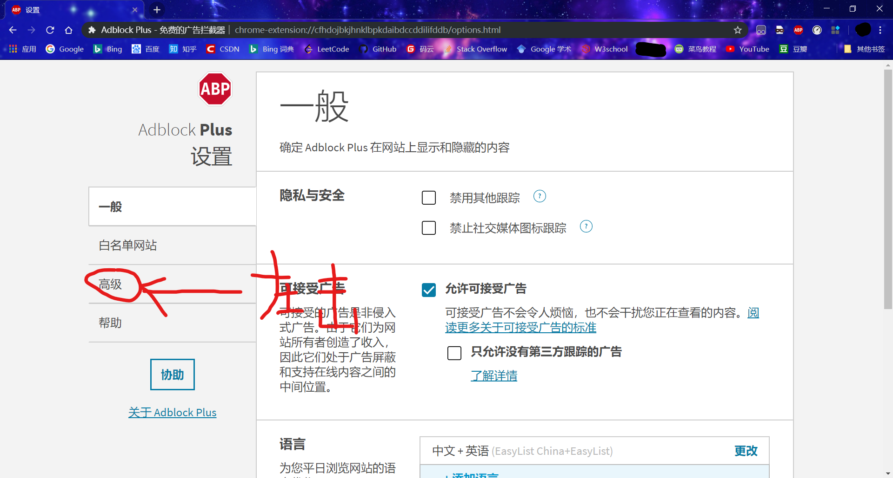
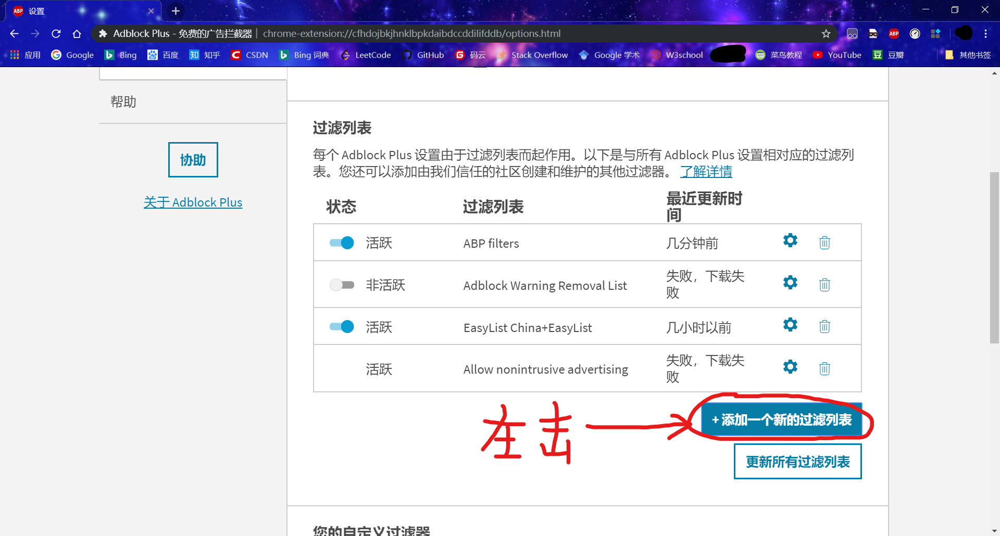
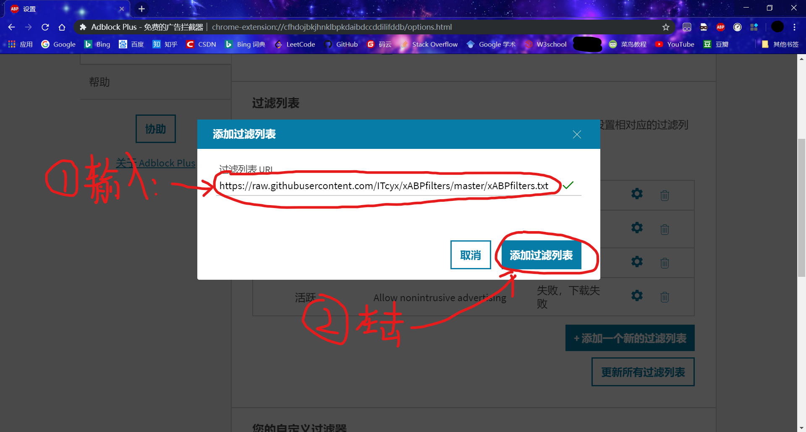
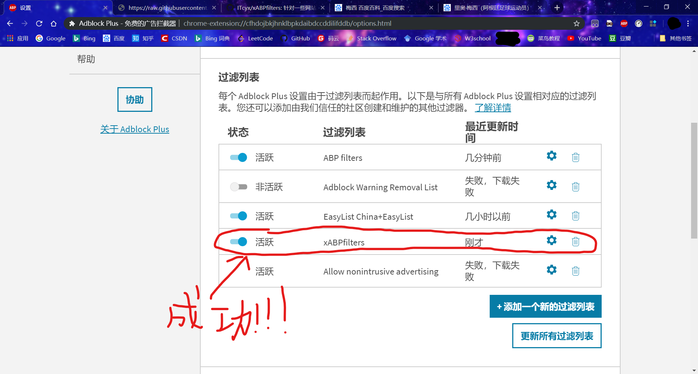

# Adblock Plus 配置步骤

1. 打开 Chrome 或者 Firefox （这里以 Chrome 为例， Firefox 的配置步骤与 Chrome 类似）。左击右上角的 ABP 插件。

2. 左击 ABP 插件界面的齿轮图标。

3. 左击弹出来的 ABP 设置界面中左边菜单栏中的“高级”选项。

4. 下拉找到“过滤列表”栏，左击“添加一个新的过滤列表”。

5. 在弹出的界面中，“过滤列表URL”下填入 https://raw.githubusercontent.com/ITcyx/xABPfilters/master/xABPfilters.txt ，然后左击“添加过滤列表”。

除上述的URL之外，还有其他针对单一网站的过滤列表：
- 针对百度的过滤列表 ( [xABPfilters baidu](baidu.txt) ) ： https://raw.githubusercontent.com/ITcyx/xABPfilters/master/baidu.txt

6. 如果在过滤列表中出现 xABPfilters 等字样，即为成功添加过滤列表。
